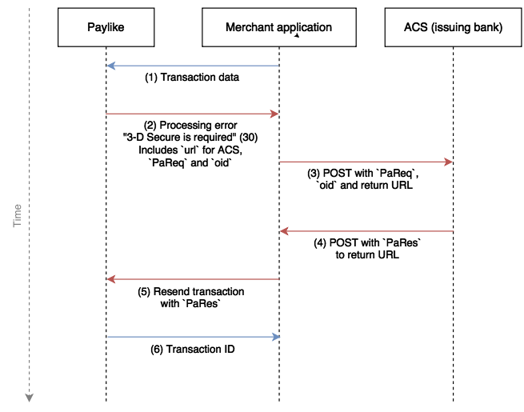

Implementing 3-D Secure is a substantial work that can directly affect
your conversion rate. We recommend all customers implement
[our popup](https://github.com/paylike/sdk) which supports 3-D Secure and has
been extensively tested and improved over the years.

This information is highly simplified to give you just enough
information to successfully implement 3-D Secure with Paylike.

# How does 3-D Secure work?

The idea of 3-D Secure is to allow the issuing bank to obtain a second form of
authentication for a transaction (two-factor authentication). If the
transaction is approved by the bank, the (financial) risk of unauthorized
transactions is shifted from the merchant to the bank (liability shift).

This is currently implemented by the banks as a web server to which the
merchant (e.g. a webshop) redirects the cardholder (e.g. a customer) with
information about the transaction (referred to as `PaReq`), the cardholder
then interacts with the web page from the bank using any authentication
technique the bank prefers (common ones are OTP tokens sent as text messages),
the bank then directs the cardholder back to the merchant along with another
value (referred to as `PaRes`), and finally you submit the transaction for
processing as normal, but including the `PaRes` as proof that the bank
acknowledges the transaction.

# Implementing with Paylike

You will need a live account at Paylike (free, no approval needed) with
mandatory 3-D Secure (the default anyway). 3-D Secure can be conditionally
enabled/disabled by Paylike based on a risk assessment.

If you are using the Paylike Payment popup, you do not have to read any
further. 3-D Secure is supported and handled automatically inside the popup.

However, if you are developing a native application or going for a customized
payment form and want to leverage 3-D Secure, here is the minimal information
you need.

A simplistic overview of the flow looks like the following:



Blue connections are present in regular transactions whereas red ones are
specific to 3-D Secure. The first (processing error) and last (resending
transaction) red connections are simply a special case of the regular error
handling flow.

What this means is that you can develop progressively starting with the
standard flow, then evolve your implementation to handle the special error
(code 30) later.

## Examples

Step (1) is preferably initiated from the client side, to avoid credit card
details touching your server.

If step (1) is initiated using the Web SDK, the call might look like this:

```js
paylike.pay('form.payment', {
	currency: 'USD',
	amount: 100,
});
```

If initiated from a native app (iOS, Android, etc.) or the server it would do
something equivalent to:

```sh
$ curl 'https://gateway.paylike.io/transactions' \
	-d "key=<public-key>" \
	-d "currency=EUR" \
	-d "amount=2000" \
	-d "card[number]=4100000000000000" \
	-d "card[expiry][month]=08" \
	-d "card[expiry][year]=2018" \
	-d "card[code]=123"
```

This is identical to any regular transaction.

The response from the gateway (2) in case of 3-D Secure being required would
be of the type:

```json
{
	"code": 30,
	"message": "3-D Secure is required",
	"client": true,
	"merchant": false,
	"tds": {
		"url": "https://acs4.3dsecure.no/mdpayacs/pareq",
		"pareq": "<string pareq>",
		"oid": "52f77cb2057463e8fa81"
	}
}
```

You are then supposed to redirect the user using a POST to the ACS url.
Example JavaScript code doing so is:

```js
var $form = ce('form', {
	method: 'POST',
	// target: 'acs-window', // iframe[name]
	action: url,
});

$form.appendChild(ce('input', {
	type: 'hidden',
	name: 'PaReq',
	value: pareq,
}));

$form.appendChild(ce('input', {
	type: 'hidden',
	name: 'TermUrl',
	value: returnUrl,
}));

$form.appendChild(ce('input', {
	type: 'hidden',
	name: 'MD',
	value: orderId,
}));

document.body.appendChild($form);

$form.submit();

function ce( tag, opts ){
	var $ = document.createElement(tag);

	Object.keys(opts).forEach(function( key ){
		$[key] = opts[key];
	});

	return $;
}
```

Once the user completes (or cancels) the 3-D Secure flow at their bank, they
will be sent to the `returnUrl` provided in (3) using another POST request
(4). This time there will be a `PaRes` value in the request body.

If integrating with an iframe it can be a bit tricky to get this value from
the iframe to the parent page. To ease this, you can use
`https://gateway.paylike.io/acs-response` for the `returnUrl` and it will use
`postMessage` to dispatch a message to any parent window containing a `pares`
key (mind the lowercase). Capture it using something like:

```js
window.addEventListener('message', function( e ){
	var pares = e.data && e.data.pares;
});
```

With the `PaRes` in hand, you can now repeat the transaction (5) as in step
(1).

Either using the Web SDK:

```js
paylike.pay('form.payment', {
	currency: 'USD',
	amount: 100,
	tds: { pares: pares },
});
```

Or from a native app or the server:

```sh
$ curl 'https://gateway.paylike.io/transactions' \
	-d "key=<publick-key>" \
	-d "currency=EUR" \
	-d "amount=2000" \
	-d "card[number]=4100000000000000" \
	-d "card[expiry][month]=08" \
	-d "card[expiry][year]=2018" \
	-d "card[code]=123" \
	-d "tds[pares]=<string pares>"
```

The gateway will return a processing error (code 31) if the 3-D Secure was not
completed (and provides liability shift).

## Inspecting `PaReq` and `PaRes`

It can be interesting to decode and inspect especially the `PaRes` value to
see the status of the 3-D Secure.

Both values are base64 encoded zlib compressed XML data. The following Node.js
script will decode one:


```js
#!/usr/bin/env node

var zlib = require('zlib');
var base64 = require('base64-stream');

process.stdin
	.pipe(base64.decode())
	.pipe(zlib.createInflate())
	.pipe(process.stdout)
```

To check the status, find the `eci` value and look it up in the following
table:

Visa | Mastercard | Status
--- | --- | ---
5 | 2 | Authentication Successful
6 | 1 | Attempts Processing Performed
7 | 0 | Authentication Failed
7 | 1 | Authentication Could Not Be Performed
7 | 0 | Error

## Testing

Testing is difficult as you control only one part of the infrastructure. We
are working hard on publishing more tools in this area, but for now you will
have to rely on creating your own mocks and doing manual integration tests
with real cards on a live account.
